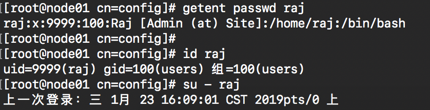

原文来自于：[Step by Step OpenLDAP Server Configuration on CentOS 7 / RHEL 7](https://www.itzgeek.com/how-tos/linux/centos-how-tos/step-step-openldap-server-configuration-centos-7-rhel-7.html)

# 环境

假设有这么两台主机，Ldap server 与client为1对多的关系。

| Hostname        | Ip            | OS      | purpose     |
| --------------- | ------------- | ------- | ----------- |
| node01.site.com | 192.168.1.100 | Centos7 | Ldap server |
| node02.site.com | 192.168.1.101 | Centos7 | Ldap client |


#  预置条件

1. 确保所有主机都可以访问
2. 确保/etc/hosts已配置主机的ip对应关系

```vim
192.168.1.100	node01.site.com	node01
192.168.1.101	node02.site.com	node02
```


# 安装openLDAP

在Ldap server节点安装一下安装包：

```bash
yum -y install openldap compat-openldap openldap-clients openldap-servers openldap-servers-sql openldap-devel
```

启动ldap服务并设置开机自启动

```
systemctl start slapd
systemctl enable slapd
```

严重ldap服务是否启动

```bash
netstat -anp | grep 389
```

输出如下：

```sh
tcp        0      0 0.0.0.0:389             0.0.0.0:*               LISTEN      1520/slapd          
tcp6       0      0 :::389                  :::*                    LISTEN      1520/slapd
```

# 设置ldap admin的密码

使用以下命令为ldap admin设置密码

```sh
slappasswd -h {SSHA} -s "密码"
```

以上命令会生成一个你输入密码的hash串，该密码将在之后的配置中使用到，所以需要记住。

**Output:**

```shell
{SSHA}9/l2ELwbWtBTip6h35bD6SQzvZMG/pMc
```

# 配置ldap server

openLDAP server的配置在/etc/openldap/sldap.d/目录下，需要将`/etc/openldap/slapd.d/cn=config/olcDatabase={2}hdb.ldif` 中以下配置进行修改

```powershell
olcSuffix – Database Suffix, it is the domain name for which the LDAP server provides the information. In simple words, it should be changed to your domain
name.

olcRootDN – Root Distinguished Name (DN) entry for the user who has the unrestricted access to perform all administration activities on LDAP, like a root user.

olcRootPW – LDAP admin password for the above RootDN.
```

但是不推荐直接对该文件进行修改，所以新建一个.ldif文件。

```
vi db.ldif
```

插入以下内容：

```sh 
dn: olcDatabase={2}hdb,cn=config
changetype: modify
replace: olcSuffix
olcSuffix: dc=site,dc=com

dn: olcDatabase={2}hdb,cn=config
changetype: modify
replace: olcRootDN
olcRootDN: cn=ldapadm,dc=site,dc=com

dn: olcDatabase={2}hdb,cn=config
changetype: modify
replace: olcRootPW
olcRootPW: {SSHA}9/l2ELwbWtBTip6h35bD6SQzvZMG/pMc	
```

将该配置导入到ldap server内

```
ldapmodify -Y EXTERNAL  -H ldapi:/// -f db.ldif
```

修改**/etc/openldap/slapd.d/cn=config/olcDatabase={1}monitor.ldif** 来使得只有ldap的最高账号ldapadm账号才能监控ldap，但是不推荐直接修改改文件，所以新建一个monitor.ldif文件，之后将该配置文件发送至ldap server。

```sh
vi monitor.ldif
```

插入以下内容：

```sh
dn: olcDatabase={1}monitor,cn=config
changetype: modify
replace: olcAccess
olcAccess: {0}to * by dn.base="gidNumber=0+uidNumber=0,cn=peercred,cn=external, cn=auth" read by dn.base="cn=ldapadm,dc=site,dc=com" read by * none
```

将该配置发送至ldap server。

```sh
ldapmodify -Y EXTERNAL  -H ldapi:/// -f monitor.ldif
```

# 设置ldap数据库

将数据库配置文件样式复制到`/var/lib/ldap`下，并赋权给ldap用户：

```sh
cp /usr/share/openldap-servers/DB_CONFIG.example /var/lib/ldap/DB_CONFIG
chown ldap:ldap /var/lib/ldap/*
```

添加cosine和nis 视图

```bash
ldapadd -Y EXTERNAL -H ldapi:/// -f /etc/openldap/schema/cosine.ldif
ldapadd -Y EXTERNAL -H ldapi:/// -f /etc/openldap/schema/nis.ldif 
ldapadd -Y EXTERNAL -H ldapi:/// -f /etc/openldap/schema/inetorgperson.ldif
```

给domain 新建base.ldif文件

```sh
vi base.ldif
```

填入以下配置，需根据具体情况修改对应配置信息

```sh
dn: dc=site,dc=com
dc: site
objectClass: top
objectClass: domain

dn: cn=ldapadm ,dc=site,dc=com
objectClass: organizationalRole
cn: ldapadm
description: LDAP Manager

dn: ou=People,dc=site,dc=com
objectClass: organizationalUnit
ou: People

dn: ou=Group,dc=site,dc=com
objectClass: organizationalUnit
ou: Group
```

建立目录结构：

```sh
ldapadd -x -W -D "cn=ldapadm,dc=site,dc=com" -f base.ldi
```

输出如下

```bash
Enter LDAP Password: 
adding new entry "dc=site,dc=com"
adding new entry "cn=ldapadm ,dc=site,dc=com"
adding new entry "ou=People,dc=site,dc=com"
adding new entry "ou=Group,dc=site,dc=com"
```

# 创建LDAP用户

创建一个名为raj的用户

```powershell
vi raj.ldif
```

填入

```sh
dn: uid=raj,ou=People,dc=site,dc=com
objectClass: top
objectClass: account
objectClass: posixAccount
objectClass: shadowAccount
cn: raj
uid: raj
uidNumber: 9999
gidNumber: 100
homeDirectory: /home/raj
loginShell: /bin/bash
gecos: Raj [Admin (at) Site]
userPassword: {crypt}x
shadowLastChange: 17058
shadowMin: 0
shadowMax: 99999
shadowWarning: 7
```

使用`ldapadd`命令在openLDAP路径下创建一个名为raj的用户。

```sh
ldapadd -x -W -D "cn=ldapadm,dc=com,dc=site" -f raj.ldif
```

输入LDAP 管理用户密码

```
Enter LDAP Password: 
adding new entry "uid=raj,ou=People,dc=com,dc=site"
```

为该用户设置一个密码

```sh
ldappasswd -s 密码 -W -D "cn=ldapadm,dc=site,dc=com" -x "uid=raj,ou=People,dc=site,dc=com"
```

验证ldap条目

```sh
ldapsearch -x cn=raj -b dc=site,dc=com
```

输出如下：

```sh
# extended LDIF
#
# LDAPv3
# base <dc=site,dc=com> with scope subtree
# filter: cn=raj
# requesting: ALL
#

# raj, People, site.com
dn: uid=raj,ou=People,dc=site,dc=com
objectClass: top
objectClass: account
objectClass: posixAccount
objectClass: shadowAccount
cn: raj
uid: raj
uidNumber: 9999
gidNumber: 100
homeDirectory: /home/raj
loginShell: /bin/bash
gecos: Raj [Admin (at) Site]
shadowLastChange: 17058
shadowMin: 0
shadowMax: 99999
shadowWarning: 7
userPassword:: e1NTSEF9Y0M1UiszYnhXSGRCQWVuTk1CQS9EWEwySi9YTGJLbFI=

# search result
search: 2
result: 0 Success

# numResponses: 2
# numEntries: 1
```

如果需要删除ldap内的一个条目，使用以下指令

```sh
ldapdelete -W -D "cn=ldapadm,dc=site,dc=com" "uid=raj,ou=People,dc=site,dc=com"
```


# 防火墙

如果防火墙开启，允许ldap服务可以被访问。

```sh
firewall-cmd --permanent --add-service=ldap
firewall-cmd --reload
```

# 开启ldap日志

```sh
vi /etc/rsyslog.conf
```

插入

```sh
local4.* /var/log/ldap.log
```

重启rsyslong

```sh
systemctl restart rsyslog
```

# 配置ldap client

在所有作为ldap client节点上运行

```sh
yum install -y openldap-clients nss-pam-ldapd
```

为了实现单点登陆，配置ldap client连接ldap server

```sh
authconfig --enableldap --enableldapauth --ldapserver=192.168.1.100 --ldapbasedn="dc=site,dc=com" --enablemkhomedir --update
```

重启ldap client服务

```sh
systemctl restart  nslcd
```

# 验证ldap登陆

获取用户条目

```sh
getent passwd raj
```


